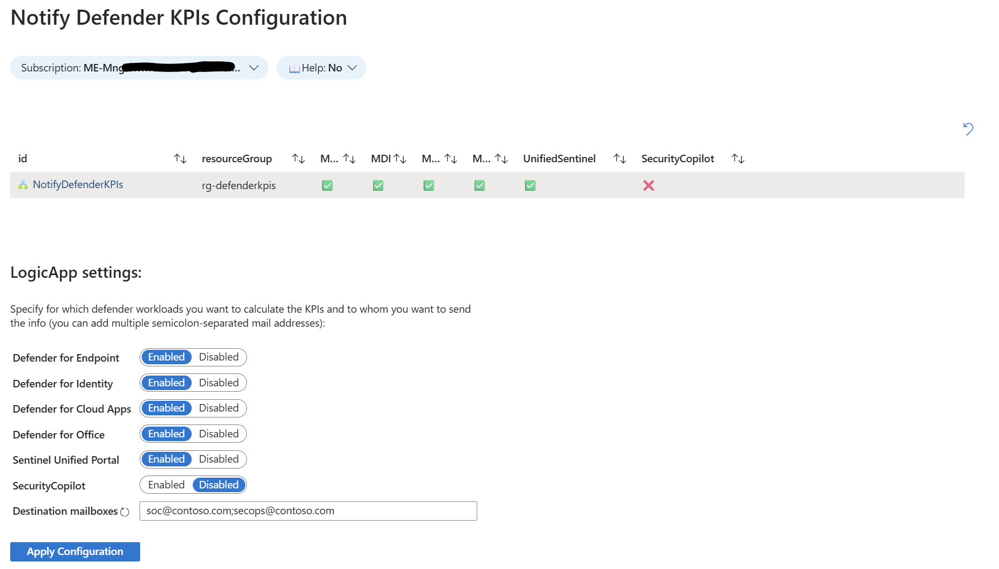
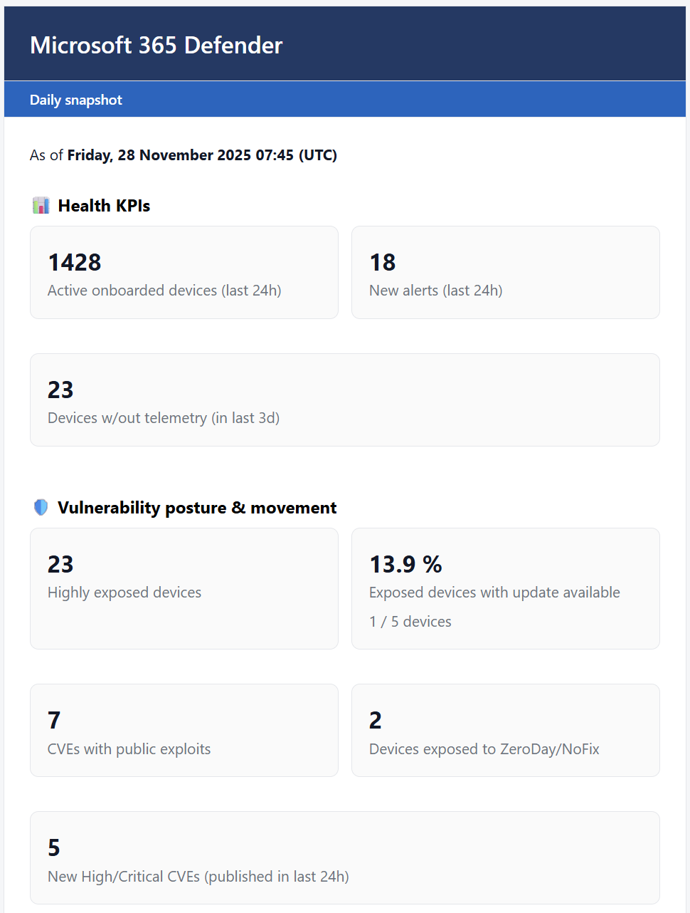
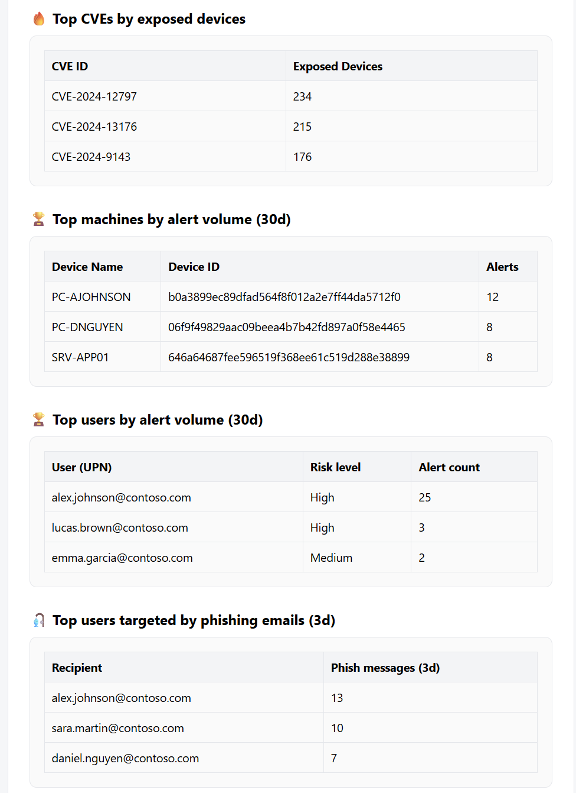
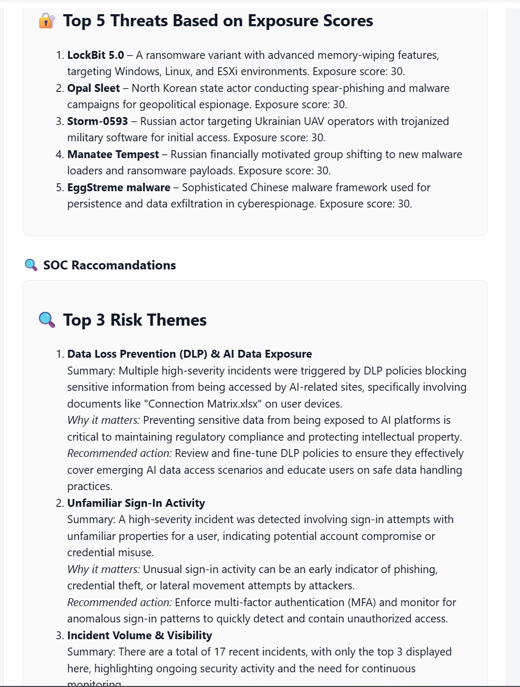
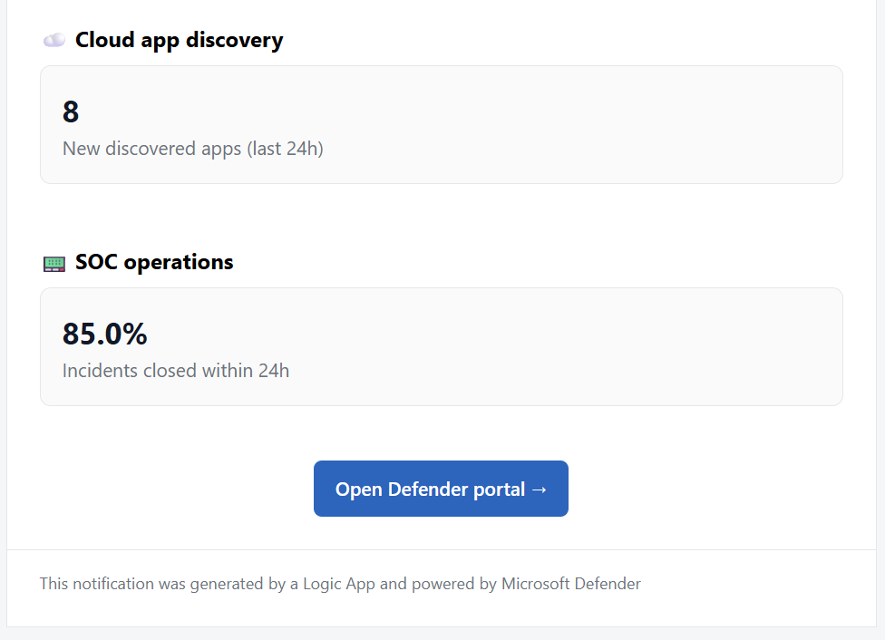

# Notify Defender KPIs with Azure Logic App

Sends a **daily Microsoft 365 Defender KPI email** to your security team. The Logic App runs hunting queries via **Microsoft Graph Security**, composes an HTML summary, and delivers it via e-mail. An **Azure Monitor Workbook** lets you choose which Defender workloads to include and who should receive the report.

[](https://portal.azure.com/#create/Microsoft.Template/uri/https%3A%2F%2Fraw.githubusercontent.com%2Fzeta-codes%2Fnotify-defender-kpis%2Frefs%2Fheads%2Fmain%2Ftemplates%2Fnotify-defender-kpis.json)

---

## What you get

- **Daily snapshot** (06:00 “W. Europe Standard Time” by default)  
- **HTML KPI email** including:
  - Defender for Endpoint coverage (onboarded devices, alerts, devices without telemetry)
  - Vulnerability posture (highly exposed devices, public exploits, zero-day/no-fix exposure)
  - Top CVEs by exposed devices
  - Top machines by alert volume
  - Top users by alert volume / phishing volume
  - Sentinel incident SLA KPI (incidents closed within 24h)
  - New discovered CloudApps
  - Threat advisory based on exposure scores
  - SOC risk themes & recommended actions
- **Workbook-driven configuration**:
  - Toggle per-workload sections (MDE, MDI, MDO, MDA, Sentinel, SecurityCopilot)
  - Configure destination recipients

---

## How it works (high level)

- **Recurrence** trigger runs every morning at 06:00, W. Europe Standard Time.
- Logic App uses its **system-assigned managed identity (MI)** to:
  - Call **ARM** to read its own configuration
  - Call **Microsoft Graph Security** for KQL-based KPIs
- **Email sections** are built dynamically based on:
  - Workbook-driven config
  - KQL results
- **Office 365 Outlook** connector sends the final HTML email to a **semicolon-separated list** of recipients.
- Optionally, if **Security Copilot** is enabled:
  - The Logic App calls the Copilot connector to generate:
    - A threat advisory section.
    - SOC risk themes & recommendations.

---

## Prerequisites

- **Azure subscription** with permission to deploy resource group–level templates.
- **Microsoft 365 Defender** enabled in your tenant with relevant data (MDE/MDI/MDO/MDA/Sentinel).
- (Optional) **Microsoft Security Copilot** if you want Copilot-based sections in the email.
- Permissions / roles:
  - To run the **PowerShell script**:
    - Tenant Global admin / security admin for Graph app-role assignment.
    - Owner or User Access Administrator on the target Logic App scope for RBAC.
  - To authorize **Office 365 Outlook** and **Security Copilot** connectors:
    - A suitable user account with send-as rights for the outbound mailbox.

---

## Quick Deploy

1. Click **Deploy to Azure** above.
2. Choose the **Subscription** and **Resource Group** where you want the Logic App.
3. Fill in the parameters (see table below).
4. Click **Review + create → Create**.
5. After deployment:
   - Run the **permissions script** to grant Graph + RBAC permissions to the Logic App MI.
   - Authorize the Office 365 Outlook and (optionally) Security Copilot connections.
   - (optional) Configure the **Workbook** to enable/disable sections and set recipients.

---

### Parameters

| Parameter                        | Example / Default        | Description                                                                 |
|----------------------------------|--------------------------|-----------------------------------------------------------------------------|
| `logicApp_name`                  | `NotifyDefenderKPIs`     | Logic App workflow name.                                                   |
| `office365_connection_name`      | `office365-conn`         | Office 365 Outlook connection resource name.                               |
| `securitycopilot_connection_name`| `securitycopilot-conn`   | Security Copilot connection resource name (used only if Copilot is enabled). |
| `destinationMail`                | `soc@contoso.com;secops@contoso.com` | Semicolon-separated list of email recipients for the KPI email. |

---

## Post-deploy steps

### 1. Grant permissions to the Logic App managed identity

Use the included PowerShell script:

```powershell
./Assign-LogicAppPermissions.ps1 -ResourceGroup "my-rg" -WorkflowName "NotifyDefenderKPIs" -TenantId "00000000-0000-0000-0000-000000000000" -SubscriptionId "00000000-0000-0000-0000-000000000000"
```
> 💡 **Tip:** You can run the permissions script either:
> - **Locally** on your machine , or  
> - From **Azure Cloud Shell** / Azure CLI in the portal by uploading the `.ps1` file and running it there

What this script does:

- Connects to **Azure** and **Microsoft Graph**.
- Finds the Logic App’s **system-assigned managed identity**.
- Assigns Microsoft Graph **ThreatHunting.Read.All** (Application) app role to that identity.
- Assigns Azure RBAC **Reader** role on the Logic App resource so it can call ARM to read tags.
- Is **idempotent** (re-running it won’t duplicate assignments).

### 2. Authorize connectors

In the Azure Portal:

1. Open the deployed **Logic App**.
2. Go to **API connections**:
   - Open the **Office 365 Outlook** connection (e.g. `office365-conn`).
   - Click **Edit API connection → Authorize**, sign in with the account that will send mail.
   - Click **Save**
3. If using **Security Copilot**:
   - Open the `securitycopilot-conn` connection.
   - Authorize it with an account approved for Copilot usage in your tenant.

### 3. (Optional) Configure the Workbook

1. Open the **Azure Monitor Workbook**: `NotifyDefenderKPIWorkflowConfig`.
2. Choose **Subscription(s)** to target.
3. Use the parameters section to configure:
   - Which Defender workloads are included in the email
   - Whether to include unified Sentinel KPIs
   - Whether to include Security Copilot insights
   - The list of recipient email addresses (semicolon-separated)
4. Click **Apply Configuration**:
   - This updates the Logic App tag `DefenderEmailConfiguration` with your selected values.
5. The next time the Logic App runs, it reads this tag and adapts the email content accordingly.

### 4. (Optional) Adjust the schedule

By default, the Logic App trigger is set to:

- **Frequency:** Day  
- **Interval:** 1  
- **Time zone:** `W. Europe Standard Time`  
- **Time:** `06:00`

You can change this in the Logic App designer if you want different timing.

---

## Troubleshooting

- **No email received**
  - Check the Logic App **Run history** for failures.
  - Verify that the Outlook connector (`office365-conn`) is **authorized** and the sending account has permission to send emails to the recipients.

- **Graph 403 / authorization failures**
  - Confirm that the **permissions script** ran successfully.
  - Ensure the account running the script has enough rights:
    - Tenant admin / security admin for Graph app-role assignment.
    - Owner / User Access Administrator on the Logic App for RBAC.

- **Workbook shows no configuration**
  - Verify that the Logic App has the `DefenderEmailConfiguration` tag set.
  - Confirm that the Logic App has **Reader** rights to its own resource (RBAC assignment).

- **Security Copilot sections missing**
  - Check that `EnableCopilot` is set to `true` in the workbook.
  - Confirm the **Security Copilot connection** is authorized and your tenant is enabled for Copilot.
  - Review the Logic App run details for any errors in the `Security_Advisory_Copilot` or `Submit_RiskThemesPrompt` actions.

---

## Screenshots


*Figure 1: Workbook to configure workloads and recipients*



*Figure 2: Example daily Microsoft 365 Defender KPI email*



*Figure 3: Example daily Microsoft 365 Defender KPI email*



*Figure 4: Example daily Microsoft 365 Defender KPI email*



*Figure 5: Example daily Microsoft 365 Defender KPI email*
