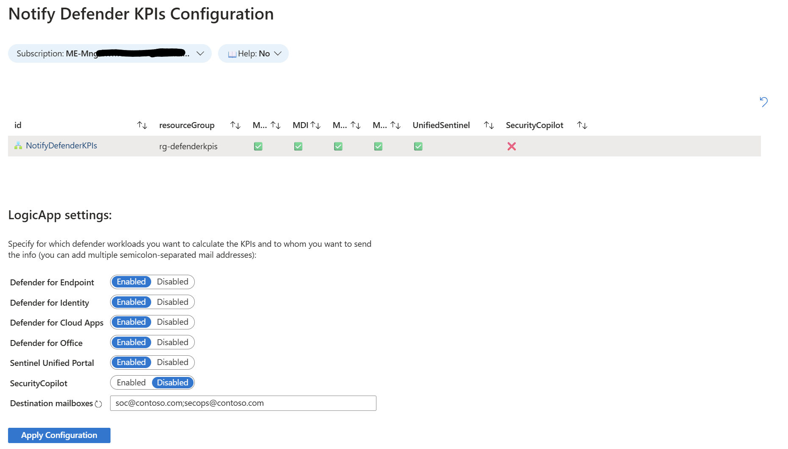
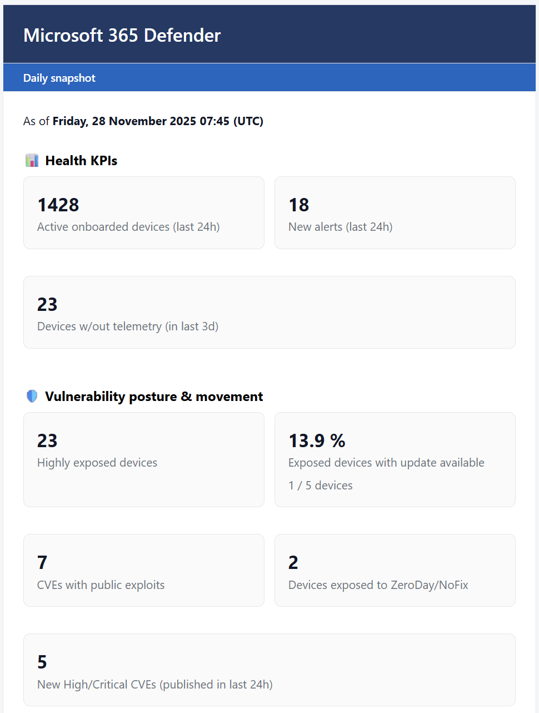
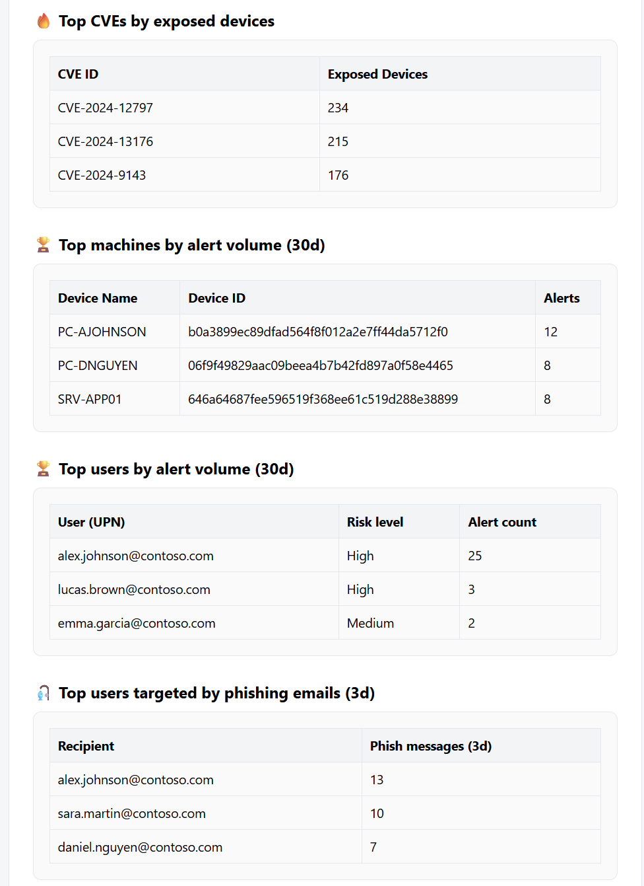
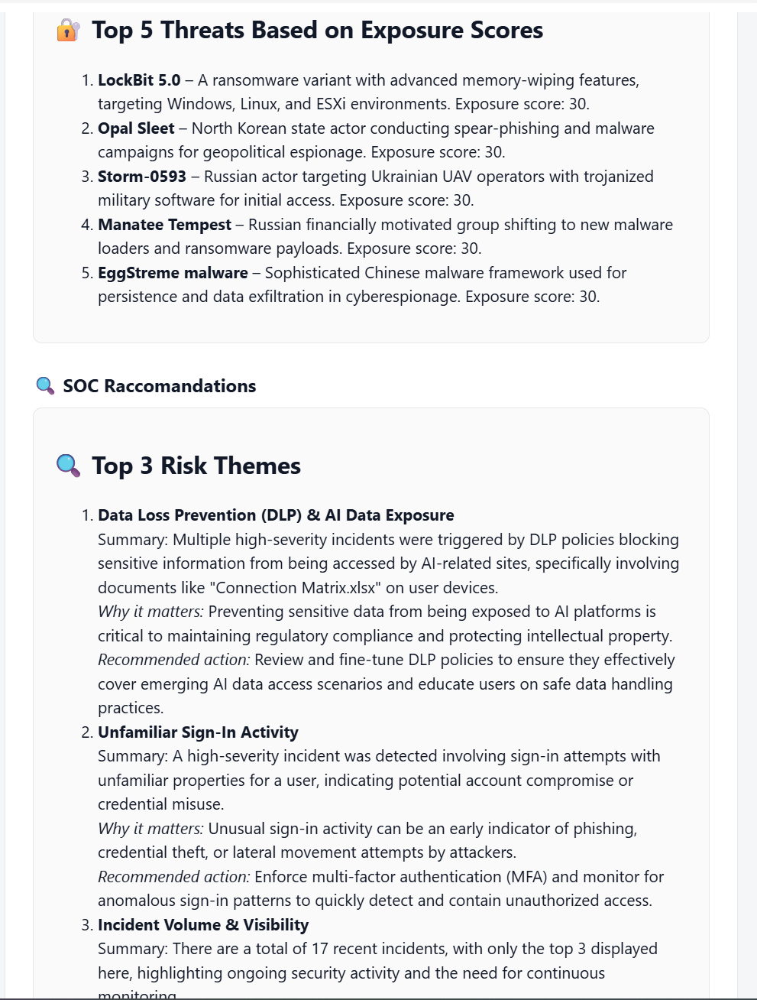
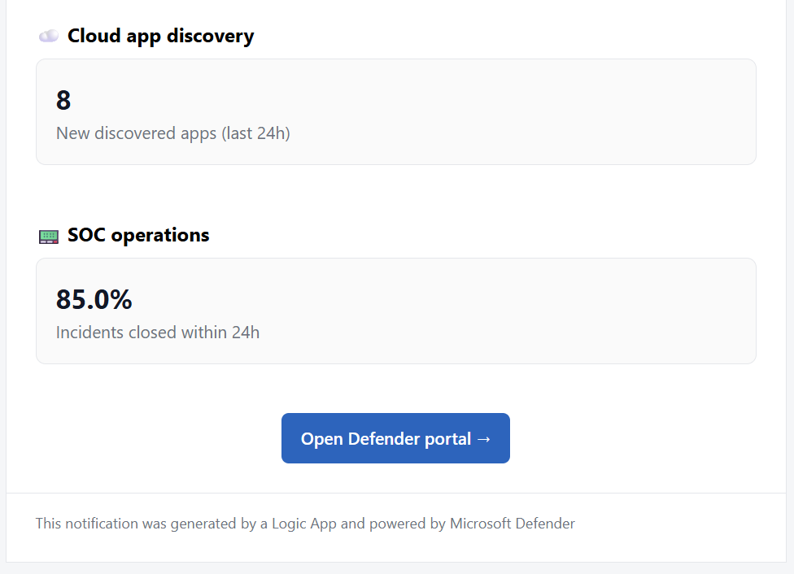

# Notify Defender KPIs with Azure Logic App

This Logic App **runs every day** and uses its managed identity to query **Microsoft Defender Advanced Hunting** to compute a set of daily **security KPIs**. It then assembles a "daily snapshot" email (optionally enriched with Security Copilot advisor/risk-theme sections) and sends it to one or more semicolon-separated recipients. An **Azure Monitor Workbook** lets you configure which Defender workloads to include and who should receive the report.

[](https://portal.azure.com/#create/Microsoft.Template/uri/https%3A%2F%2Fraw.githubusercontent.com%2Fzeta-codes%2Fnotify-defender-kpis%2Frefs%2Fheads%2Fmain%2Ftemplates%2Fnotify-defender-kpis.json)

---

## What you get

- **Daily snapshot** (06:00 “W. Europe Standard Time” by default)  
- **HTML KPI email** including:
  - Defender for Endpoint coverage (onboarded devices, alerts, devices without telemetry)
  - Vulnerability posture (highly exposed devices, public exploits, zero-day/no-fix exposure)
  - Top CVEs by exposed devices
  - Top machines by alert volume
  - Top users by alert volume / phishing volume
  - Sentinel incident SLA KPI (incidents closed within 24h)
  - Sentinel incident distribution (High/Medium/Low severity incidents)
  - New discovered CloudApps
  - Threat advisory based on exposure scores
  - SOC risk themes & recommended actions
- **Workbook-driven configuration**:
  - Toggle per-workload sections (MDE, MDI, MDO, MDA, Sentinel, SecurityCopilot)
  - Configure destination recipients

---

## How it works (high level)

- **Recurrence** trigger runs every morning at 06:00, W. Europe Standard Time (configurable).
- Logic App uses its **system-assigned managed identity (MI)** to:
  - Call **Microsoft Graph Security** for KQL-based KPIs
  - Sends email using Application Mail.Send scoped to a specific mailbox (i.e. a shared mailbox)
- **Email sections** are built dynamically based on:
  - Workbook-driven config
  - KQL results
- Optionally, if **Security Copilot** is enabled:
  - The Logic App calls the Copilot connector to generate:
    - A threat advisory section.
    - SOC risk themes & recommendations.

---

## Prerequisites

- **Azure subscription** with permission to deploy resource group–level templates.
- **Microsoft Defender** enabled in your tenant with relevant data (MDE/MDI/MDO/MDA/Sentinel).
- (Optional) **Microsoft Security Copilot** if you want Copilot-based sections in the email.
- Permissions / roles:
  - To run the **PowerShell script**:
    - Tenant Global admin / security admin for Graph app-role assignment.
    - Exchange Administrator in Entra ID and member of Organization Management in Exchange Online

---

## Quick Deploy

1. Click **Deploy to Azure** above.
2. Choose the **Subscription** and **Resource Group** where you want the Logic App.
3. Fill in the parameters (see table below).
4. Click **Review + create → Create**.
5. After deployment:
   - Run the **permissions script** to grant Graph + Exchange permissions to the Logic App MI.
   - (optional) Authorize the Security Copilot connections.
   - (optional) Configure the **Workbook** to enable/disable sections and set recipients.

---

### Parameters

| Parameter                        | Example / Default        | Description                                                                 |
|----------------------------------|--------------------------|-----------------------------------------------------------------------------|
| `logicApp_name`                  | `NotifyDefenderKPIs`     | Logic App workflow name.                                                   |
| `securitycopilot_connection_name`| `securitycopilot-conn`   | Security Copilot connection resource name (used only if Copilot is enabled). |
| `destinationMail`                | `soc@contoso.com;secops@contoso.com` | Semicolon-separated list of email recipients for the KPI email. |
| `senderMailbox`                | `no-reply-sec@contoso.com` | Mailbox used to send the KPI email. |

---

## Post-deploy steps

### 1. Grant permissions to the Logic App managed identity

Use the included PowerShell script:

```powershell
./Assign-LogicAppPermissions.ps1 -ResourceGroup "my-rg" -WorkflowName "NotifyDefenderKPIs" -TenantId "00000000-0000-0000-0000-000000000000" -SubscriptionId "00000000-0000-0000-0000-000000000000" -SharedMailboxAlias "my-shared-mailbox"
```
> 💡 **Tip:** You can run the permissions script either:
> - **Locally** on your machine , or  
> - From **Azure Cloud Shell** / Azure CLI in the portal by uploading the `.ps1` file and running it there

What this script does:

- Connects to **Azure** and **Microsoft Graph**.
- Finds the Logic App’s **system-assigned managed identity**.
- Assigns Microsoft Graph application permissions needed by the workflow.
- Configures Exchange Online RBAC for Application Mail.Send scoped to the specified shared mailbox.
- Is **idempotent** (re-running it won’t duplicate assignments).

### 2. (Optional) Authorize connectors

In the Azure Portal:

1. Open the deployed **Logic App**.
2. Go to **API connections**:
   - Open the **Security Copilot** connection.
   - Click **Edit API connection → Authorize**, sign in with an account approved for Copilot usage in your tenant.
   - Click **Save**

### 3. (Optional) Configure the Workbook

1. Open the **Azure Monitor Workbook**: `NotifyDefenderKPIWorkflowConfig`.
2. Use the parameters section to configure:
   - Which Defender workloads are included in the email
   - Whether to include unified Sentinel KPIs
   - Whether to include Security Copilot insights
   - The list of recipient email addresses (semicolon-separated)
3. Click **Apply Configuration**
4. The next time the Logic App runs, it reads this configuration and adapts the email content accordingly.

### 4. (Optional) Adjust the schedule

By default, the Logic App trigger is set to:

- **Frequency:** Day  
- **Interval:** 1  
- **Time zone:** `W. Europe Standard Time`  
- **Time:** `06:00`

You can change this in the Logic App designer if you want different timing.

---

## Troubleshooting

- **Graph 403 / authorization failures**
  - Confirm that the **permissions script** ran successfully.
  - Ensure the account running the script has enough rights:
    - Tenant Global admin / security admin for Graph app-role assignment.
    - Exchange Administrator in Entra ID and member of Organization Management in Exchange Online.

- **Security Copilot sections missing**
  - Check that `EnableCopilot` is set to `true` in the workbook.
  - Confirm the **Security Copilot connection** is authorized and your tenant is enabled for Copilot.
  - Review the Logic App run details for any errors in the `Security_Advisory_Copilot` or `Submit_RiskThemesPrompt` actions.

---

## Screenshots


*Figure 1: Workbook to configure workloads and recipients*



*Figure 2: Example daily Microsoft 365 Defender KPI email*



*Figure 3: Example daily Microsoft 365 Defender KPI email*



*Figure 4: Example daily Microsoft 365 Defender KPI email*



*Figure 5: Example daily Microsoft 365 Defender KPI email*
